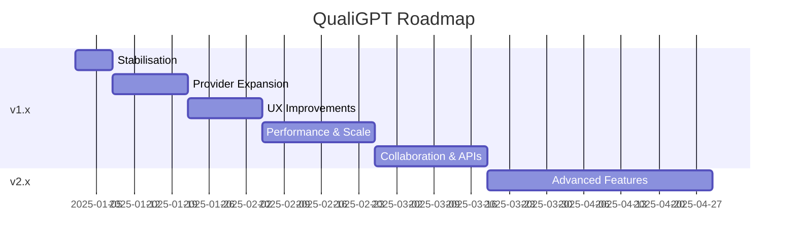

# QualiGPT – Project Improvement Roadmap

> **Purpose:** Provide a pragmatic, step-by-step plan for evolving QualiGPT from the current MVP into a production-grade, feature-rich toolkit.

---

## 0. Guiding Principles

1. **User-Centric** – features validated with real researchers.
2. **Modular** – clean separation between UI, API layer, AI providers, and data processing.
3. **Open & Documented** – every change carries docs and tests.
4. **Secure by Default** – no PII leaks; least-privilege design.

---

## 1. Stabilisation (v1.1)
| Week | Task | Owner | Success Criteria |
|------|------|-------|------------------|
| 1 | Complete unit-test baseline (pytest) for Flask routes | Dev A | >90% route coverage, CI green |
| 1 | Lint & format (ruff + black) adopt pre-commit | Dev B | `pre-commit run --all-files` passes |
| 2 | Introduce typing (`mypy`) across codebase | Dev A | `mypy` < 5 errors |
| 2 | CI pipeline (GitHub Actions) with test + lint matrix | Dev C | Green builds on PRs |

---

## 2. Provider Expansion (v1.2)
1. **DeepSeek Full Integration**  
   • Implement SDK wrapper & update UI icons  
   • Add load-balanced retry logic for rate limits
2. **Local LLM Support (Optimum/ggml)**  
   • Optional llama.cpp backend for offline usage  
   • Docker image with quantised model cache

Deliverable: dropdown now lists 5+ providers, each tested via E2E.

---

## 3. User Experience (v1.3)
* **Rich Result Viewer** – render GPT table into sortable HTML grid. **[DONE]**
* **Model Selection** – choose model per provider in UI. **[DONE]**
* **Advanced Settings** – temperature, max tokens, etc. in UI. **[DONE]**
* **Reliable CSV Export** – client-side, matches table. **[DONE]**
* **Theme Visualisations** – bar chart of participant counts (Chart.js).
* **Dark Mode** toggle.
* **Autosave Sessions** – LocalStorage restore on refresh.

---

## 4. Performance & Scale (v1.4)
1. **Async Processing** – Celery + Redis queue to offload long jobs.
2. **Streaming SSE** – live token stream to UI for large analyses.
3. **File > 100 MB Support** – chunk upload + chunk processing.

KPIs: handle 10 concurrent 100k-token jobs under 5 min each.

---

## 5. Collaboration & APIs (v1.5)
* **Multi-User Accounts** – JWT auth, PostgreSQL store.
* **REST/GraphQL API** for programmatic submissions.
* **Webhooks** – notify when analysis completes.

---

## 6. Advanced Features (v2.x)
1. **Real-Time Co-Coding** – WebSocket shared cursors.
2. **Automated Quote Selection** – GPT picks representative quotes.
3. **Sentiment + Emotion Layers**.
4. **Survey Platform Integration** – Qualtrics + Google Forms import.

---

## 7. Security & Compliance
* **Pen-Test** each release.
* **GDPR Data-Retention Policy** docs & enforcement.
* **CSP & HTTPS Everywhere** – default Docker compose uses Traefik.

---

## 8. Documentation Milestones
| Version | Docs Deliverable |
|---------|------------------|
| 1.1 | How-to-contribute guide + code style guide |
| 1.2 | Provider integration tutorial |
| 1.3 | User manual with screenshots (in progress, updating for new UI) |
| 1.4 | Deployment guide (Kubernetes & AWS Fargate) |
| 2.0 | Research methodology white-paper |

---

## 9. Timeline Overview (Gantt-like)

---

## 10. Risk & Mitigation
| Risk | Impact | Mitigation |
|------|--------|-----------|
| LLM API pricing spikes | High | Caching + local models fallback |
| Provider deprecations | Medium | Abstraction layer shields breaking changes |
| Large file mem usage | High | Stream to disk, chunk processing |
| Compliance audits | Medium | Adopt SOC2 checklist early |

---

## 11. Done-Definition Checklist
- [x] Rich result viewer, model selection, advanced settings, and CSV export implemented
- [ ] Theme visualisations and dark mode
- [ ] Autosave sessions
- [ ] Code has ≥95% test pass rate
- [x] Docs updated (in progress)
- [ ] Security scan clean
- [ ] Demo video recorded

---

*Last updated: {{date}}* 